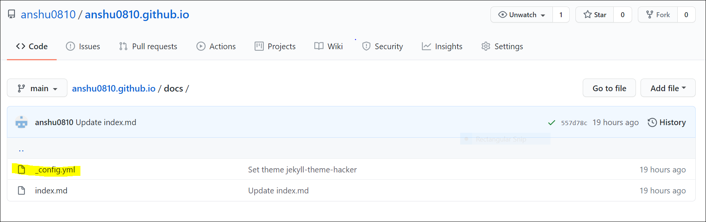

# How to host your Resume on GitHub?

This document provides a quick guide on how to use and format a resume online by using:
1. a lightweight markup language(Markdown),
2. a static site generator(Jekyll) and,
3. sharing/hosting it on a distributed version control system(GitHub Pages).

## Why you should consider hosting your resume online ?

Making a resume in a .pdf or .docx is outdated and tedious. You need tools to quickly update your resume and instead of uploading multiple files. What you need is a short link to a website where your potential employers can view your resume. As Andrew Etter mentions in his book [*Modern Technical Writing*](https://www.amazon.ca/Modern-Technical-Writing-Introduction-Documentation-ebook/dp/B01A2QL9SS) 

>"that hosting your content on a website gives you the power to fix inaccuracies almost instantly."

This document will guide you to accomplish that goal. If you follow the steps of this readme then you will end up with a website that would look like the this gif.

## What you need before we get started?
1. An account on [github](https://github.com/).
1. A resume formatted in [markdown](https://daringfireball.net/projects/markdown/) named **index.md**. 
1. [Github Desktop application](https://desktop.github.com/).

## Let's Get Started.
1. Login on [Github Pages](https://github.com/). Andrew Etter mentions that distributed version control systems (DVCS) like Git have better performance than centralized systems and allows the writer to work on documentation offline. Distributed version control Systems also allow multiple people to work and collaborate together.
This is perfect as you will not need to be online to edit or make changes to your resume.

2. Create a new repository. 

3. Name your repository **yourusername.github.io**. It is important for you to name the repository exactly in this format because github pages allow one domain per account and github pages needs to know which repository to host. As you can see below:

 

4. Make the repository public so potential employers can see it and initialize the repository with a Readme file.

5. Click on `add files` and upload your resume in markdown format and name it as **index.md**. Make sure that you are working in your **main branch**. Etter also mentions the value of markdown in his book *Modern Technical Writing* and says that

>"Markdown has the cleanest syntax and it is easy to write and read." Here is a [cheatsheet](https://www.markdownguide.org/cheat-sheet/) for Markdown syntax.

**Note: If your resume file is not named as index.md then the github pages won't host your resume because it looks for this file.**

6. Next step is to Clone your repository so you can work offline or make changes to it offline as well.
   * Click on `Code` button and then select `github desktop`.
   * It will open your github desktop application and then you can choose the path for your repository and clone it.
   * Well Done! Now you can make changes to your resume here and later update them online.

Finally, you want your Website to look more appealing and presentable.

7. Go to **yourusername.github.io** and Click on `Settings`. 
   * Scroll down till you find Github Pages and then Click on `Choose a theme`.
   * Select a theme which suits your resume.
   * Github uses [Jekyll](https://github.com/jekyll/jekyll) a static site generator to make your themes. Etter makes great point about static site generators in his book as        he argues that

   >They are easy to move because they don't have any server-side application dependencies, and nothing to install. They cannot be hacked like Wordpress because they are not dynamic and you can test them in your local computer because there are no softwares to install.

8. After you Select your theme, it creates a .yaml file in your repository where your theme is stored as shown below.
   * You can even make your own custom Jekyll theme and add to your repository. 
   * Here is a [Step by Step tutorial](https://jekyllrb.com/docs/step-by-step/01-setup/) to build a Jekyll site by scratch.

9. After few minutes your website will be created and you're **DONE.**

10. You can see your website on **yourusername.github.io/.**

## More resources

1. A quick tutorial for [Markdown](https://www.markdowntutorial.com/)

2. A [list of Markdown editors](https://www.oberlo.ca/blog/markdown-editors) by OS. 

3. Andrew Etter's book [*Modern Technical Writing*](https://www.amazon.ca/Modern-Technical-Writing-Introduction-Documentation-ebook/dp/B01A2QL9SS)

4. A tutorial on how to use [Jekyll](https://www.youtube.com/playlist?list=PLLAZ4kZ9dFpOPV5C5Ay0pHaa0RJFhcmcB)

## Acknowlegments
I would like to thank my group members **Evan Marshall, Seunghwan Youn and Tehillah Kangamba** for their contributions in helping me making this Website and this document.
I would also like to thank Andrew Etter for his very helpful and informative book *Modern Technical Writing*.

## FAQS
1. **Why is Markdown better than Microsoft Word ?**
    * Markdown is easy to format and remains consistent across different platforms compared to Word. It is readable and easy to learn. Word files often needs formatting when you transfer them across different softwares and sometimes may even loose some data. Converting a markdown file into other formats is very convenient and it doesn't disrupt your formatting. 
 
2. **Why I cannot see changes to my website after working on it offline?**
    * The reason that you cannot see changes to your website after working on it offline is that you may not have updated your file using GitHub Desktop.
      Here are some steps that will help you:
      
     1. Open github Desktop.
     2. Click on `Commit to main`.
     3. Click `Push to origin`. 
     4. Refresh your webpage and then you can see your changes.

3. **Can I add images to my resume?**
    * Yes, you can add images to your resume. Here's how
    
    1. Open your repository.
     2. Click on `Add file`.
     3. Upload your file.
     4. Edit your resume and using markdown syntax put the relative path of your image.
       
       > ``
